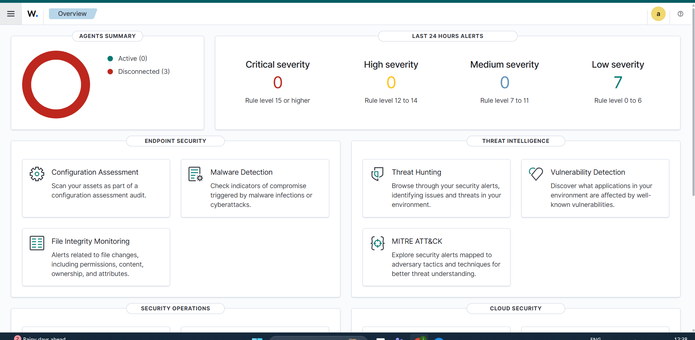
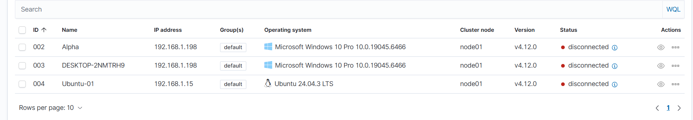
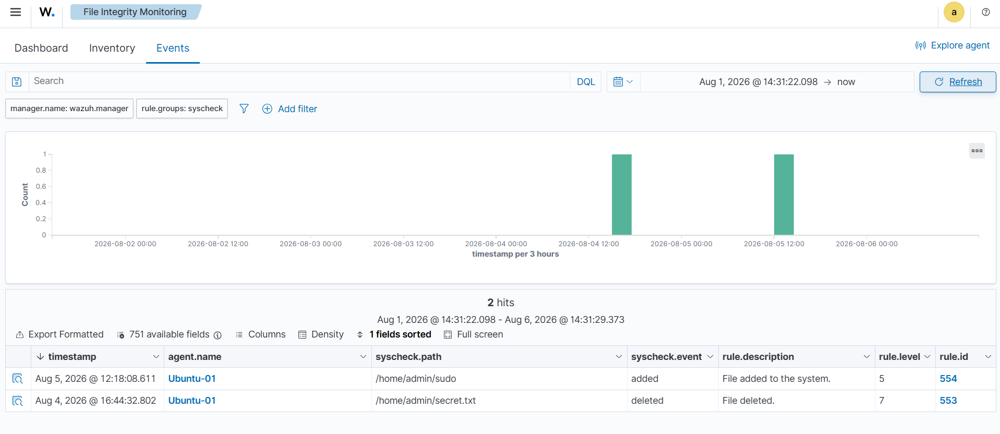
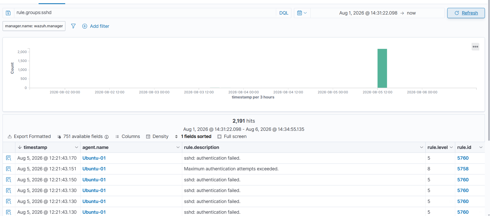
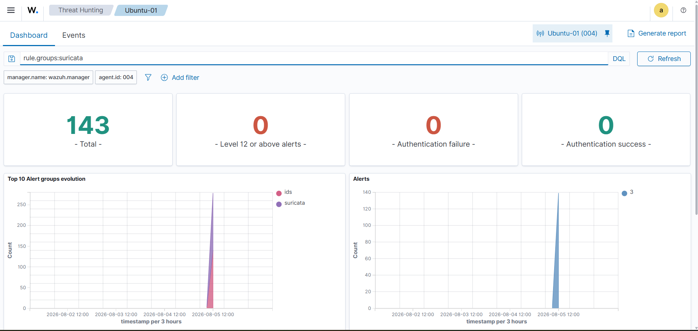

# 🛡️ Wazuh SOC Home Lab

> Enterprise-style Security Operations Center (SOC) Home Lab built using **Wazuh SIEM**, **Docker**, **Ubuntu**, **Kali Linux**, and **Suricata IDS** for threat detection, security monitoring, and incident investigation.

---

## 📌 Overview

This project demonstrates how to build a practical SOC environment capable of collecting, monitoring, and investigating security events from Linux endpoints.

The lab focuses on real attack simulations, detection engineering, and security monitoring using open-source security tools.

---

# 🏗️ Lab Architecture

```text
                    Internet
                        │
                        │
             ┌────────────────────┐
             │    Kali Linux      │
             │  Hydra • Nmap      │
             └─────────┬──────────┘
                       │
                192.168.1.0/24
                       │
      ┌────────────────┴────────────────┐
      │                                 │
┌─────▼─────┐                  ┌────────▼─────────┐
│ Ubuntu VM │                  │ Docker Host      │
│ Wazuh     │─────────────────►│ Wazuh Manager    │
│ Agent     │                  │ Wazuh Indexer    │
│ Suricata  │                  │ Wazuh Dashboard  │
└───────────┘                  └──────────────────┘
```

---

# 🚀 Features

- Docker-based Wazuh deployment
- Ubuntu endpoint monitoring
- Kali Linux attack simulation
- File Integrity Monitoring (FIM)
- SSH Brute Force Detection
- Nmap Service Enumeration
- Suricata IDS Integration
- Security Event Investigation
- MITRE ATT&CK Mapping

---

# 🧪 Detection Labs

| Detection | Status |
|-----------|--------|
| Wazuh Installation | ✅ |
| Ubuntu Agent | ✅ |
| Kali Linux Agent | ✅ |
| File Integrity Monitoring | ✅ |
| SSH Brute Force Detection | ✅ |
| Nmap Detection | ✅ |
| Suricata IDS | ✅ |
| Active Response | 🚧 In Progress |
| Windows Sysmon | 📅 Planned |
| Sophos Firewall Integration | 📅 Planned |

---

# 🛠️ Technologies

| Category | Technology |
|----------|------------|
| SIEM | Wazuh |
| Containerization | Docker |
| Operating System | Ubuntu 24.04 |
| Attack Machine | Kali Linux |
| IDS | Suricata |
| Reconnaissance | Nmap |
| Password Testing | Hydra |
| Monitoring | Wazuh Agent |
| Framework | MITRE ATT&CK |

---

# 📂 Project Structure

```text
Wazuh-SOC-Home-Lab/
│
├── README.md
├── LICENSE
├── .gitignore
│
├── docs/
│   ├── Installation.md
│   ├── Architecture.md
│   └── Troubleshooting.md
│
├── detections/
│   ├── FIM.md
│   ├── SSH-BruteForce.md
│   ├── Nmap.md
│   └── Suricata.md
│
├── screenshots/
│
├── configs/
│
└── assets/
```

---

# 🎯 Skills Demonstrated

- Security Monitoring
- Linux Administration
- Docker
- Network Security
- Threat Detection
- Incident Investigation
- File Integrity Monitoring
- IDS Monitoring
- Log Analysis
- MITRE ATT&CK Mapping

---

# 🛣️ Roadmap

## Version 1.0

- [x] Wazuh SIEM
- [x] Ubuntu Agent
- [x] Kali Linux
- [x] File Integrity Monitoring
- [x] SSH Brute Force Detection
- [x] Nmap Detection

## Version 2.0

- [x] Suricata IDS
- [ ] Active Response
- [ ] Threat Hunting Dashboard

## Version 3.0

- [ ] Windows Sysmon
- [ ] Sophos Firewall Integration
- [ ] Sigma Rules
- [ ] Email Alerting

---

# 📸 Screenshots

## 🖥️ Wazuh Dashboard



## 👥 Wazuh Agents



## 📁 File Integrity Monitoring



## 🔐 SSH Brute Force Detection



## 🛡️ Suricata IDS


---
# 📄 License

This project is licensed under the MIT License.

---

# 👨‍💻 Author

**Jay Soni**

- Network Administrator
- Cyber Security Enthusiast
- SOC Analyst Aspirant

GitHub:
https://github.com/JAXY1304
